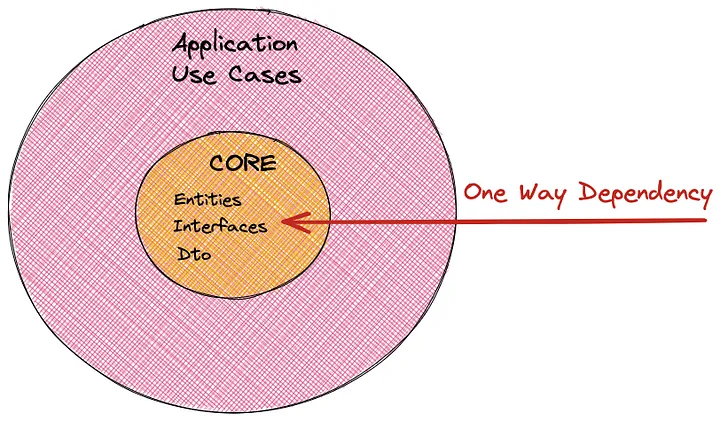
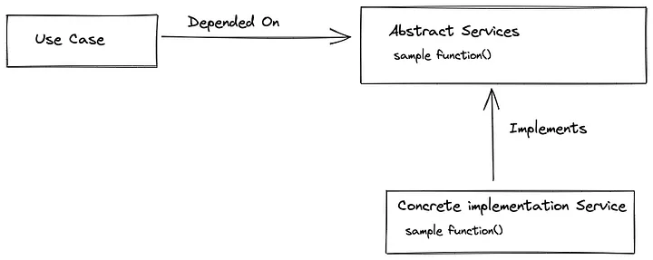

###  Explanation Of Clean Architecture

- **Layers**: Each ring represents an isolated layer in the application.
## 
- **Dependency**: The dependency direction is from the outside in. Meaning that the entities layer is independent and the frameworks layer (web, UI, etc.) depends on all the other layers.
## 
- **Entities**: Contains all the business entities that construct our application.
## 
- **Use cases**: This is where we centralize our logic. Each use case orchestrates all of the logic for a specific business use case (for example adding new customers to the system).
## 
- **Controllers and presenters**: Our controllers, presenters, and gateways are intermediate layers. You can think of them as an entry and exit gate to the use cases.
## 
- **Frameworks**: This layer has all the specific implementations. The database, the web frameworks, error handling frameworks, etc. Robert C. Martin describes this layer: “This layer is where all the details go. The web is a detail. The database is a detail. We keep these things on the outside where they can do little harm.”
##
### In the heart of the application, we have two layers:
## Entities layer: 
Contains all the business entities that construct our application.
## Use cases layer: 
Contains all the business scenarios that our application supports.


## Entities
The business entities in our app are:
```bash
export class User {
  id: number;
  email: string;
  password: string;
  // todos? :  Todo[]
  createdAt?: Date;
  updatedAt?: Date;

}
```
```bash
export class Todo {
  id: number;
  title: string;
  description: string;
  completed: boolean;
  userId: number;
  createdAt?: Date;
  updatedAt?: Date;

}
```

## Use Cases
This is where we centralize our logic. Each use case orchestrates all of the logic for a specific business use case.
- **Register a user**.
- **Login a user and return the token**
```bash
@Injectable()
export class UserUseCases {
  constructor(
    private dataServices: IDataServices,
    private userFactoryService: UserFactoryService,
  ) {}
  ...
  async register(createUserDto: CreateUserDto): Promise<User> {
    const user = await this.userFactoryService.createNewUser(createUserDto);
    return this.dataServices.user.register(user);
  }
  ...
```
- **Create a Todo**.
- **Get list of Todos**
```bash
@Injectable()
export class TodoUseCases {
  constructor(
    private dataServices: IDataServices,
    private todoFactoryService: TodoFactoryService,
  ) {}

  async createTodo(createTodoDto: CreateTodoDto): Promise<Todo> {
    if (!createTodoDto.userId) {
      throw new UserIdIsRequiredException();
    }
    if (!createTodoDto.title || createTodoDto.title.trim().length === 0) {
      throw new TodoTitleCannotBeEmpty();
    }
    const todo = this.todoFactoryService.createNewTodo(createTodoDto);
    const userNotExists = await this.dataServices.todo.checkUserExist(todo.userId);
    if (userNotExists) {
      throw new UserNotFoundException();
    }
    return this.dataServices.todo.createTodo(todo);
  }
  ...
```
## Services(Database)
The use case needs to persist the user details and check that it doesn’t exist in the system. 
This functionality can be implemented as a class that calls SQL 
##
With Abstractions we will define a contract between the use cases and the frameworks.
Basically, the contracts are the function signatures of the desired services.
For example, the Database service needs to provide 
a “create” function that create a User object as a parameter and returns a promise.



## Controllers and Presenters
Our controller, presenters, and gateways are intermediate layers. You can think of them as an adapter that glues our use cases to the outside world and back the other way.

**Controllers**
- Receive the user input — some kind of DTO.
- Validate user input-sanitization.
- Convert the user input into a model that the use case expects.  
- Call the use case and pass it the new model.

-**The controller is an adapter and we don’t want any business logic here, only data formatting logic.**
```bash
...
export class CreateUserDto {
  @ApiProperty({ example: 'Jimi', description: 'name of user' })
  @IsString()
  @IsNotEmpty()
  name: string;

  @ApiProperty({ example: 'email@demo.com', description: 'the email address' })
  @IsString()
  @IsNotEmpty()
  @IsEmail()
  email: string;

  @ApiProperty({ example: 'password', description: 'the password of the user' })
  @IsString()
  @IsNotEmpty()
  @Length(6, 30)
  password: string;
}
...
```

## Frameworks
this layer includes all our specific implementations, such as the database, monitoring, billing, error handling, etc.
